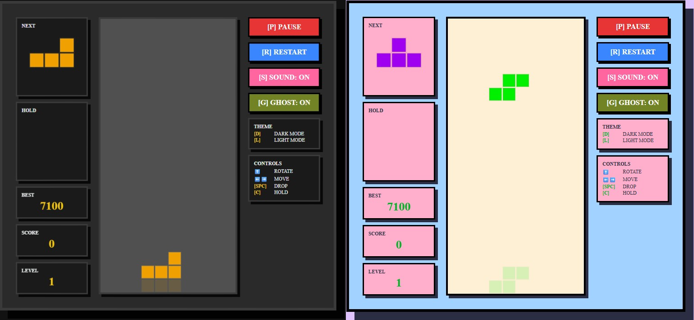

<div align="center">
  <br />
    <a>
      
    </a>


  <br />
  <h3 align="center"> Tetris </h3>
</div>

## <a name="table">Table of Contents</a>

1. [Introduction](#introduction)
2. [Key Features](#key-features)
3. [Controls](#controls)
4. [Project Structure](#project-structure)
5. [Quick Start](#quick-start)


## <a name="introduction">Introduction</a>

Classic Tetris clone featuring a Python (Flask) logic engine and an Angular 18 frontend.

## <a name="key-features">Key Features</a>

- Ultra-Responsive UI: Scales perfectly to any screen size using CSS transforms.
- Theme Engine: Quick toggle between Dark/Light modes and Ghost piece visibility.
- Logic Isolation: Game mechanics and collision detection are handled entirely in Python.
- Synthesized Sound: Unique audio profiles for Move, Rotate, Clear, and Drop using mathematical oscillators (Zero asset files).

## <a name="controls">Controls</a>

|Key| Action|
|-----|-----|
|← →|Move|
|↑|Rotate|
|Space|Hard Drop|
|G|Toggle Ghost|
|S|Toggle Sound|
|D/L|Dark/Light Theme|


## <a name="project-structure">Project Structure</a>

```bash
tetris/
├── backend/
│   ├── app.py
│   ├── highscore.txt
│   └── requirements.txt
├── frontend/
│    ├── angular.json
│    ├── package.json
│    ├── package-lock.json
│    ├── tsconfig.json
│    ├── tsconfig.app.json
│    └── src/
│       ├── main.ts
│       ├── styles.css
│       ├── index.html
│       ├── app/
│       │     ├──audio.service.ts
│       │     ├──app.component.ts
│       │     ├──app.component.css
│       │     └──app.component.html
│       ├── env/
│            ├──env.ts
│            └──env.dev.ts
├── README.md
├── tetris.png
└── .gitignore

```

## <a name="quick-start">Quick Start</a>


1. Clone
```bash
# Clone the Repository
git clone https://github.com/sdulal412/tetris.git
cd tetris
```

2. Backend
```bash
cd backend

# Install dependencies
pip install flask flask-cors

# Run the local server on http://localhost:5000
python app.py
```

3. Frontend

```bash
cd frontend

# Install dependencies (only the first time)
npm install

# Runs the local on http://localhost:4200
ng serve

```
